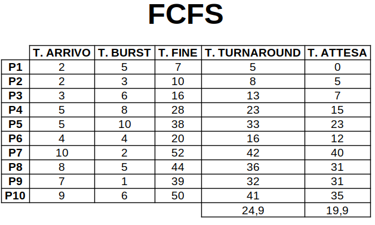

# SSP

## Simulatore di scheduling dei processi

"Sistemi Operativi Laboratorio" - _Professoressa Diletta Romana
Cacciagrano_ [link](https://computerscience.unicam.it/diletta-cacciagrano) 
[Computer Science](https://computerscience.unicam.it/) - Università di Camerino [Unicam](https://www.unicam.it/).

### Obiettivo

Sviluppare un’applicazione per Linux, utilizza Ubuntu 20.04.4 LTS

- Language C
- Multi process
- System calls
    - primitive synchronization
    - file system
    - communication
    - signals

### Descrizione

La gestione dei CPU burst e degli I/O burst da parte dello scheduler del sistema operativo è un aspetto importante per
garantire l'efficienza del sistema e l'utilizzo ottimale delle risorse della CPU. 
Il simulatore sviluppato simula 4 algoritmi di scheduling:

- FCFS (First Come, First Served)
- RR (Round Robin)
- SJF (Short Job First)
- SRTF (Short Remaining Time First)

A schermo visualizza il diagramma di GANTT dell'esecuzione dei processi per ogni algoritmo e infine una tabella
che mostra i risultati. 
Viene reso disponibile anche un file contenente 10 processi pronti per l'utilizzo.

| Processo | Tempo di arrivo | Tempo di burst |
|:--------:|:---------------:|:--------------:|
|    P1    |        2        |       5        |
|    P2    |        2        |       3        |
|    P3    |        3        |       6        |
|    P4    |        5        |       8        |
|    P5    |        5        |       10       |
|    P6    |        4        |       4        |
|    P7    |       10        |       2        |
|    P8    |        8        |       5        |
|    P9    |        7        |       1        |
|   P10    |        9        |       6        |

Completata la simulazione viene chiesto all'utente se vuole salvare i dati generati in un file o meno.
Il simulatore permette di ripetere la simulazione all'infinito.

In caso di input dell'utente non validi, il programma si interrompe.

### Analisi delle principali system call utilizzate

Nel programma non sono utilizzate direttamente delle system call, ma vengono sfruttate delle funzioni di libreria
standard C o funzioni di alto livello che sfruttano le system call sottostanti fornite dal sistema operativo:

- **Operazioni di I/O su file**: apertura e la chiusura di file con **_fopen_** e **_fclose_**, la lettura da file con *
  *_fread_**, la scrittura su file con **_fprintf_**. Queste funzioni possono tradursi in system call come **open**, *
  *close**, **read** e **write** per operazioni effettive su file descriptor.
- **Gestione della memoria**: L'allocazione e la liberazione della memoria dinamica con funzioni come **malloc** e
  **free**. Queste funzioni possono coinvolgere la gestione della memoria da parte del sistema operativo tramite system
  call come **brk** o **mmap**.
- **Interazione con il sistema operativo**: La funzione _**usleep**_ può utilizzare la system call **nanosleep** per
  introdurre ritardi. L'uso di _**exit**_ termina il processo e può essere considerato come un'interazione con il
  sistema operativo.

### Esempi

Gli esempi sotto sono le simulazioni "fatte a mano" di ogni algoritmo per i processi presenti nel file "*processi.json*"
 
 

